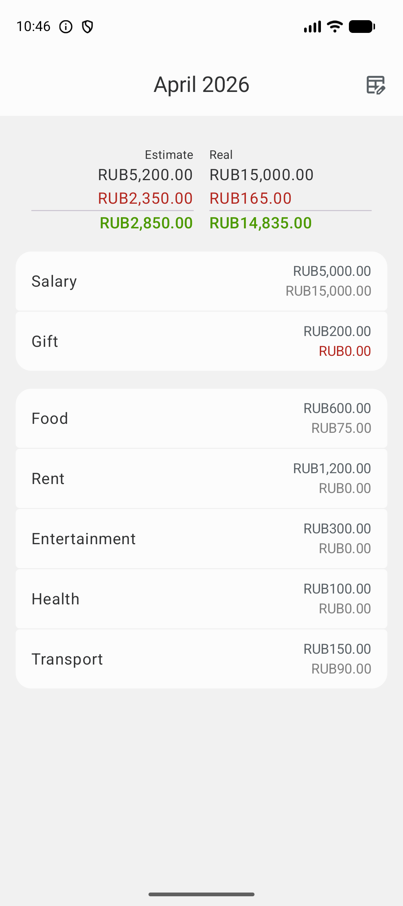
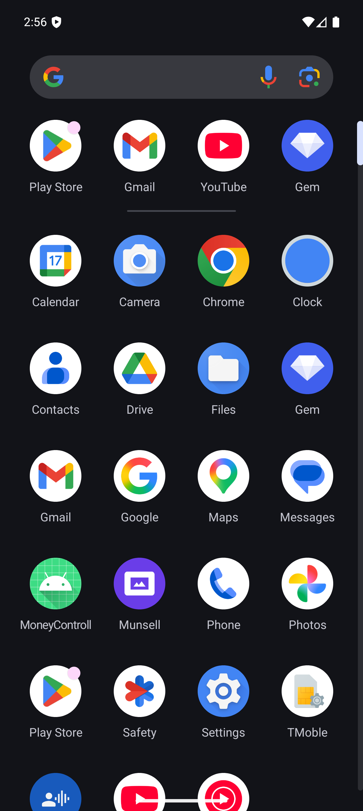
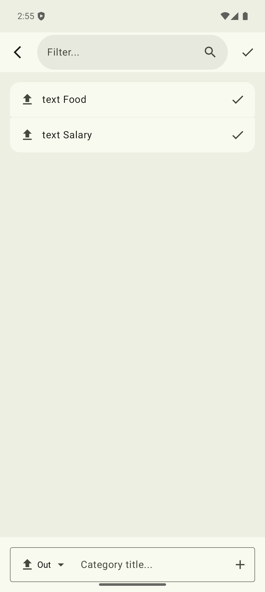
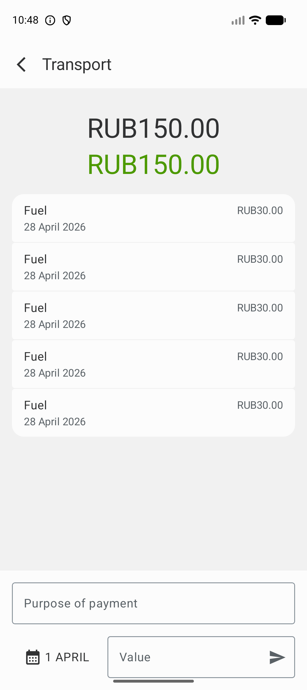
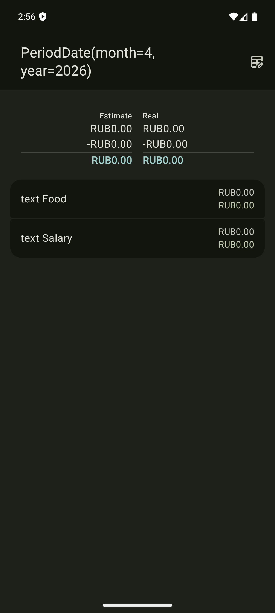

# MoneyControll

**MoneyControll** is a modern, cross-platform personal finance management application built with **Kotlin Multiplatform** and **Compose Multiplatform**. It is designed with a focus on **Hexagonal Architecture** to ensure maintainability, testability, and a clear separation between business logic and platform-specific implementations.

## Features

- **Cross-Platform Support**: Seamlessly runs on **Android**, **iOS**, and **Desktop (JVM)**.
- **Budget Planning**: Organize your finances by custom periods (e.g., monthly).
- **Flexible Categories**: Create, customize, and manage income and expense categories.
- **Transaction Tracking**: Detailed record-keeping for every transaction within a category.
- **Local-First Reliability**: Robust offline capabilities using **Room** for local data persistence.
- **Modern UI**: Clean and responsive interface using **Material 3** and **Adaptive Layouts**.

## Screenshots

### Main Screen
| Light Mode | Dark Mode |
| :---: | :---: |
|  |  |

### Categories Management
| Light Mode | Dark Mode |
| :---: | :---: |
|  |  |

### Record Details & Transactions
| Light Mode | Dark Mode |
| :---: | :---: |
|  |  |

## Tech Stack

- **Kotlin**: 2.3.20
- **UI Framework**: [Compose Multiplatform](https://www.jetbrains.com/lp/compose-multiplatform/)
- **Dependency Injection**: [Koin](https://insert-koin.io/)
- **Database**: [Room (KMP)](https://developer.android.com/kotlin/multiplatform/room)
- **Navigation**: [Navigation3](https://developer.android.com/jetpack/compose/navigation)
- **Networking**: [Ktor](https://ktor.io/)
- **Architecture**: Hexagonal Architecture (Domain, Ports, Adapters)
- **Build System**: Gradle with Version Catalogs (`libs.versions.toml`)

## Project Structure

The project follows a modular Hexagonal Architecture:

* **[`/core`](./core)**: The heart of the application. Contains domain entities and **Ports** (interfaces) that define business rules without any external dependencies.
* **[`/feature`](./feature)**: Contains feature-specific logic and UI. Each feature (e.g., `:period`, `:category`, `:record`) is modularized.
* **[`/infrastructure`](./infrastructure)**: Implements the Ports defined in the `core` layer (**Adapters**). This includes the Room database implementation and external storage logic.
* **[`/composeApp`](./composeApp)**: The main entry point. Orchestrates navigation between features and handles global DI configuration.
* **[`/core-ui`](./core-ui)**: A shared library of reusable UI components and the application's design system.
* **[`/shared`](./shared)**: Common platform-specific bridge code and utilities.
* **[`/iosApp`](./iosApp)**: Native iOS project wrapper.

## Getting Started

### Prerequisites
- **JDK 17** or higher
- **Android Studio** (Koala or newer) or **IntelliJ IDEA**
- **Xcode** (for iOS development)

### Build and Run

#### Android
```shell
./gradlew :composeApp:assembleDebug
```

#### Desktop (JVM)
```shell
./gradlew :composeApp:run
```

#### iOS
1. Navigate to the `/iosApp` directory.
2. Open `iosApp.xcworkspace` in Xcode.
3. Select a target simulator and run the project.

---
Developed with a commitment to clean code and modern Kotlin Multiplatform standards.
